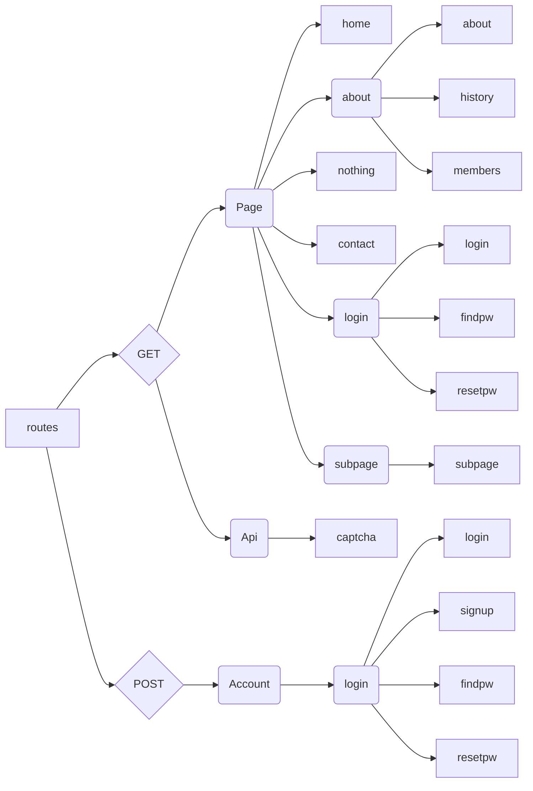

# Happy Infinite Company

---

## routes.go

```mermaid
graph LR;
    A[routes] --> B{GET};
    A --> C{POST};

    B --> BA(Page);
    B --> BB(Api);

    BA --> BAA[home];
    BA --> BAB(about);
    BA --> BAC[nothing];
    BA --> BAD[contact];
    BA --> BAE(login);
    BA --> BAF(subpage);

    BB --> BBA[captcha];

    BAB --> BABA[about];
    BAB --> BABB[history];
    BAB --> BABC[members];

    BAE --> BAEA[login];
    BAE --> BAEB[findpw];
    BAE --> BAEC[resetpw];

    BAF --> BAFA[subpage];

    C --> CA(Account);

    CA --> CAA(login);

    CAA --> CAAA[login];
    CAA --> CAAB[signup];
    CAA --> CAAC[findpw];
    CAA --> CAAD[resetpw];

```
